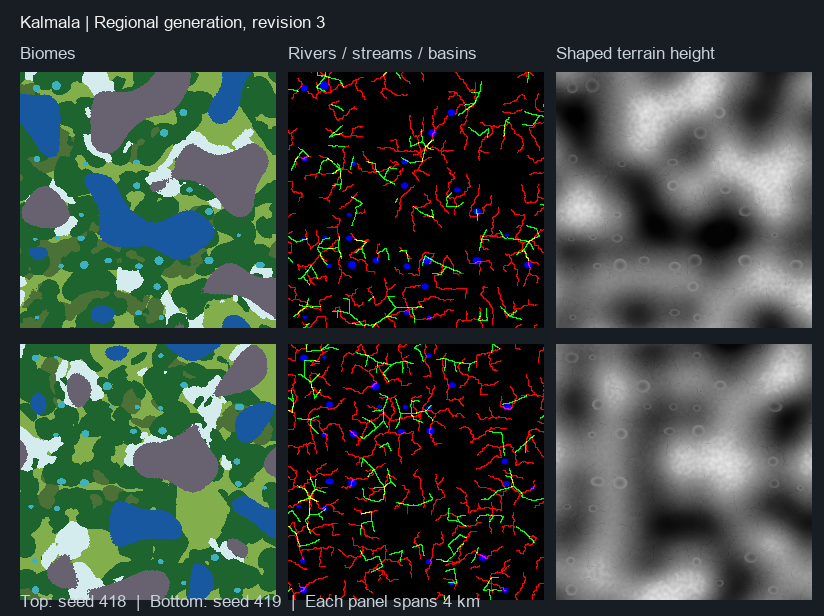

# World generation and biome roadmap

## Direction

Kalmala is a seed-generated, player-directed open wilderness. The world contains no authored gameplay areas, fixed camp zones, prescribed routes, or required quest sequence. Players choose where to travel, build, gather, and take risks.

The world is built from continuous procedural maps, not a visible square grid. Streaming limits and server spatial partitions exist only to manage performance, spawning, and persistence; they must never shape biome boundaries or create gameplay zones.

Kalmala may learn from broad survival-world principles—shared seeds, player-made homes, environmental risk, and landmark-led discovery—but must remain wholly original in its world layout, content, names, visual language, and implementation.

## Goals

1. **A world worth wandering.** Terrain, weather, and natural features should invite curiosity without giving players a required route.
2. **Shelter changes travel.** Different environments alter how players prepare, build, and move through the world.
3. **A shared world.** The same seed and generator revision produce the same world for every player in a session.
4. **Optional discovery.** Resources, wildlife, hazards, and points of interest enrich exploration without becoming a checklist.
5. **Multiplayer-safe scale.** The server owns gameplay state while clients receive only the information needed to render and play nearby world content.

## World seed and generation

The server creates and saves two immutable values with every world:

- `WorldSeed` — unsigned 64-bit value that defines the world.
- `GeneratorRevision` — version of the generation rules used to create it.

Changing either value creates a different base world. Existing saves must never silently reinterpret terrain or object locations after a generator revision changes.

### Four continuous Perlin maps

The generator derives four independent Perlin-noise maps from the world seed. Each map uses its own deterministic sub-seed so that changing one map's tuning does not accidentally reshape the others.

| Map | Controls | Derived uses |
| --- | --- | --- |
| **Elevation** | Height of the terrain | Slope, drainage, lakes, shorelines, cliffs, and mountain forms. |
| **Humidity** | Availability of surface and ground moisture | Wet ground, lakeside conditions, marsh potential, and vegetation support. |
| **Temperature** | Local climate tendency | Snow, frost, rainfall type, warmth pressure, and cold-weather conditions. |
| **Flora** | Vegetation suitability and density | Meadows, forest density, ground cover, and plant population potential. |

At any world position, the generator samples all four maps, normalizes the results, and classifies the biome from their combined values. Biome transitions are continuous blends, not fixed-width borders. Wind, wetness, wildlife, ruins, scroll sites, and harvest nodes are generated later; they are not additional biome maps.

```text
WorldSeed + GeneratorRevision
  -> Perlin maps: Elevation, Humidity, Temperature, Flora
  -> sample at world position
  -> terrain and biome classification
  -> seeded world content
  -> weather, survival, and player-made changes
```

## Biome palette

### Legacy terrain-based classifier (generator revision 2)

Revision 2 remains available for existing worlds; new worlds now default to revision 3. Selection uses only the existing four normalized fields, in priority order: submerged terrain (`Elevation < 0.22`) is Ocean; peaks (`> 0.78`) are Thunder Mountains; cold uplands (`Elevation >= 0.55`, `Temperature < 0.35`) are Freezing Tundra. Mossy Mire requires low ground (`Elevation < 0.45`), high moisture (`Humidity > 0.72`), and temperate conditions (`Temperature >= 0.28`). Remaining wet lowlands (`Elevation < 0.55`, `Humidity > 0.63`) are Shimmering Lakes. Elderwood requires both dense growth (`Flora > 0.64`) and moisture (`Humidity >= 0.35`); remaining land is Meadows.

These are original terrain-suitability rules, with no distance-from-spawn progression or extra noise map. Classification returns one dominant biome; it does not calculate slope, blend weights, or connected water basins. Existing continuous fields still drive terrain and environmental variation, and the separate lake-basin query determines visible standing water.

Revision 1 retains its original classifier and field seeds. Sampled fields carry revision metadata so existing callers select the correct rules. Use `-GeneratorRevision=1` to reopen the old layout (`-Revision=1` for visualization). Revision 2 creates a different base world because revision also participates in field seeds. The serialized config default remains 1 for compatibility; new-world entry points now select revision 3. Revision-2 population saves use a seed/revision-specific slot, leaving the legacy revision-1 slot intact; no save schema is changed.

Development order is not player progression. The seed decides which biomes are nearby; players decide whether and when to enter them.

| Biome | Character | Shelter and travel pressure | Discovery focus | Development order |
| --- | --- | --- | --- | --- |
| **Meadows** | Gentle hills, moderate humidity, open sightlines. | Introduces fire cover, simple timber shelter, and dry storage. | Deer routes, stones, birch stands, and calm camp locations. | First |
| **Shimmering Lakes** | Interlocking lakes, shore fog, and saturated low ground. | Favors bridges, boats, dry stores, and raised shelter. | Fishing waters, small islands, and lake-edge resources. | Second |
| **Elderwood** | Dense canopy, deep shade, and heavy growth. | Rewards marked trails, compact camps, and careful visibility management. | Ancient roots, wildlife dens, and overgrown stone sites. | Third |
| **Mossy Mire** | Wet ground, slow travel, and dry hummock paths. | Rewards raised floors, drainage, and waterproof fuel storage. | Bog iron, causeways, and Mireling scavenging sites. | Fourth |
| **Freezing Tundra** | Bitter wind, sparse cover, and rolling high ground. | Rewards insulated clothing, enclosed roofs, and windbreaks. | Ice-fed springs, exposed shrines, and weather-read routes. | Fifth |
| **Thunder Mountains** | Sheer ridges, thunder squalls, and exposed passes. | Rewards lightning-safe shelter, durable construction, and route planning. | Storm-carved overlooks, mineral seams, and deep cave systems. | Sixth |
| **Ocean** | Open water, currents, waves, and storms. | Rewards seaworthy construction, anchors, and coastal shelters. | Distant islands, sea caves, and rare shoreline materials. | Seventh |

Biomes should differ primarily through environment, travel, and shelter—not a linear increase in enemy strength. Every reachable biome needs a viable lower-risk approach and a riskier shortcut or reward opportunity.

## Seeded world content

Terrain and biomes establish the world; separate seeded systems populate it. No area is assigned a mandatory purpose.

- Wildlife, harvest nodes, and hazards use deterministic server-side spatial seeds and spawn budgets.
- Weather is a server-owned deterministic cycle derived from the immutable world identity and a cycle index; it is not a biome map and never creates weather zones.
- Landmarks and major discoveries are optional points of interest generated by their own seed rules.
- Decorative vegetation, rocks, and ambient detail are cosmetic where possible; gameplay-relevant content is server-owned.
- Player-made changes override generated content through persisted save data.

## Multiplayer, persistence, and performance

- The server generates and persists all gameplay-affecting placements, AI, harvest state, hazards, construction, and survival state.
- Clients may generate cosmetic detail locally, but never decide gameplay placement, loot, damage, or rewards.
- Save only sparse player/world deltas keyed by `WorldSeed`, `GeneratorRevision`, and a server spatial key; never serialize the entire generated base world.
- Server spatial partitions are implementation-defined and invisible to players. They may manage activation and budgets, but may not create square biome borders or authored gameplay areas.
- Use instancing or pooling for non-interactable vegetation and rocks. Promote only nearby interactive content to replicated actors.
- Profile generation time, memory, replicated actor count, save size, and late-join synchronization before increasing content density or streaming distance.

## Delivery roadmap

Build the world in visible, playable layers. Start the next phase only when the preceding phase is repeatable and stable in host/client play.

### 1. Seed and map proof

Generate the four Perlin maps and a developer-only visualization for terrain and biome classification.

**Done when:** the same seed always produces the same maps and biome layout, while a different seed visibly produces a different world.

### 2. First playable generated world

Turn the map output into traversable terrain with a seed-generated player start, Meadows, lakes, trees, and rocks. Do not add a fixed sanctuary, quest route, boss arena, or authored map area.

**Done when:** host and client can travel through the same generated terrain and see the same meaningful natural features.

### 3. Natural population

Add seeded wildlife, harvest nodes, hazards, and ambient detail. Keep gameplay-relevant spawning server-owned and budgeted.

**Done when:** the same seed produces matching gameplay content and consumed or defeated content remains consistent after reconnecting.

### 4. Weather, shelter, and survival

Connect rain, wind, wetness, warmth, fires, and shelter to the generated terrain. Environment should influence preparation and travel without blocking exploration behind a quest.

**Done when:** players naturally choose different routes, camps, and gear because of the terrain and weather they encounter.

### 5. Companion minimap

Add a circular, top-right minimap that keeps the owning player at its centre, shows facing direction, and uses mouse-wheel zoom clamped between tunable minimum and maximum levels. It is a local UI view of available seed-derived terrain, water, and player-facing landmarks; it must not reveal hidden server-owned gameplay content, create a second biome map, or direct travel.

**Done when:** the map remains circular and legible at supported UI scales and aspect ratios, zoom clamps at both bounds, and host/client peers each see only their own player-centred local view without any gameplay-state mutation.

### 6. Add biomes one at a time

Add Shimmering Lakes, Elderwood, Mossy Mire, Freezing Tundra, and Thunder Mountains individually. Each biome needs a clear environmental identity, original content, and a reason to build or travel differently.

The shared biome-expansion contract uses the existing world identity, four-field classifier, invisible server spatial keys, and Phase 4 exposure inputs. It defines deterministic terrain-feature intent, bounded per-kind population multipliers, normalized exposure modifiers, and stable terrain-aligned discovery candidates. A candidate is not content: only its completed biome slice may have the server materialize it, replicate it when relevant, and persist a sparse state delta. A server-only feature inspection may report a nearby classifier seam and candidate identifier for development; it must not reveal, reserve, or route players toward a discovery.

Shimmering Lakes is complete: continuous patch rendering supplies interlocking collision-free water and shore treatment, while its server slice increases wet-shore pressure through the existing exposure loop and resolves one dry, water-adjacent optional harvest discovery from the active server spatial key. The discovery uses the normal validated harvest and sparse depletion path. It adds no boat, swimming physics, route, bridge, island crossing requirement, or authored camp location.

Elderwood is complete: local terrain presentation derives larger field-driven canopy and non-colliding root buttresses, with continuous Flora leaving lower-density natural clearings. Its server slice applies the Elderwood population and exposure profile only at Elderwood-classified keys and pawn positions, and resolves at most one gently sloped, lower-flora optional harvest discovery per active key. The compact canopy reduces wind and increases natural cover relative to open ground through the existing exposure loop. It adds no trail, route, reserved camp, authored clearing, or client-selected discovery.

Thunder Mountains is complete: continuous elevation forms high, steep-but-traversable ridges without designed passes. Its server slice applies the bounded mountain population and stronger-wind profile only at Mountain-classified keys and pawn positions, and resolves at most one high-ridge storm-carved overlook harvest discovery per active key. Existing server weather and player-built roof/windbreak shelter provide storm and lightning-safe-enclosure preparation. It adds no precision gate, authored route, reserved shelter, client-selected discovery, or new persistence contract.

**Done when:** every added biome is enjoyable on its own, blends naturally with its neighbours, and remains consistent for host and client.

### 7. Coherent biome generation and hydrology (revision 3)

The regional generator retains four authoritative continuous source fields. Elevation uses a 100,000 cm noise wavelength with only 1.5% local relief amplitude; Humidity and Temperature use 150,000 cm wavelengths. Flora remains local at roughly 1,333 cm and never selects a regional biome or shapes terrain. These wavelengths describe noise sampling, not guaranteed biome diameters.

`FKalmalaRegionalTuning` centralizes the 60,000 cm macro scale, regional frequency, 120,000 cm warp wavelength, 8,000 cm warp displacement, ring overlap and edge waves, source frequencies, and hydrology dimensions. These are versioned developer constants, printed in visualization `Tuning.txt`, rather than mutable client settings. Changing production tuning requires another generator revision.

Each biome has seeded offsets and overlapping concentric core/ring signals around procedural centers, with continuous motion noise and angular sine edge variation. Signals are evaluated on demand, never stored as a biome map. Environmental suitability bounds Elderwood by moisture, Mire by humid temperate lowlands, and Tundra by cold uplands. Normalized weights blend terrain-shaping contributions; maximum weight selects a dominant label, ties follow the stable enum order. Submerged source terrain explicitly selects Ocean and mountain-height source terrain selects Thunder Mountains. Meadow retains a nonzero fallback weight. Physical coast/mountain transition weights are smooth even when the dominant label changes.

Shimmering Lakes requires a deterministic source-qualified basin, not just humidity. Seeded lowland centers on a coarse 40,000 cm lattice produce separated elliptical bowls with raised enclosing rims, 4,000–8,500 cm major radii, and source-relative water levels. A broad lake-region signal and center climate qualify each bowl. The bowl and its rim blend into surrounding terrain; lake weights cover the water and immediate banks. This replaces flood-cache decisions only for revision 3. Legacy lake flood-fill semantics remain intact for revisions 1 and 2.

Rivers and streams derive separate candidate sets from 18,000 cm coarse cells. Nearby candidates coalesce to the lowest stable seed ID within 5,000 cm. Each retained point connects to an eligible lower neighbor within 28,000 cm with deterministic score/tie order. Streams require both ends on low land (40–560 cm above sea, starts at least 80 cm). Sine-displaced spline samples share exact endpoints and use seeded amplitude, wavelength, and phase; samples are at most 250 cm apart along the underlying segment. River/stream influence widths are 600/220 cm. A 6,000 cm spatial index includes every intersecting segment envelope across cell edges. Only generated spline segments are cached, bounded to 256 cells for one identity; eviction, rebuild, and query order do not change the network.

Final height blends per-biome relief, then enclosed bowls and continuous channel carving. Inland water levels are clipped against those same shaped terrain triangles and interpolated at intersections, including river grades. Sea depth continues to use the shared final collision-triangle plane. The minimap interpolates the same inland water-depth differences on the same lattice. Basin rims take precedence over channel carving to retain enclosure. This is deterministic geometric hydrology; it does not simulate water volume, catchment discharge, erosion, currents, flooding, or inland swimming physics.

Revision 4 retains all revision-3 regional and hydrology rules, then adds occasional deterministic 6,500–10,000 cm-radius emergent islands from a 60,000 cm coarse lattice. Their centres, radii, summits, submerged aprons, and shore blend are derived solely from the immutable identity; no island map, actor, replicated placement, or save data exists. Revisions 1–3 remain byte-for-byte terrain-compatible. New game worlds and preview commandlets select revision 4. Serialized config defaults, revision-1/2 source sampling, terrain formulas, classifiers, and legacy save identities remain unchanged. Use the original seed and its original `-GeneratorRevision` to reopen an existing layout. Revision-3/4 population deltas use the existing identity-specific save-slot convention and unchanged schema. The server owns world identity, population, interactions, exposure, and persistence; client terrain and water are reproducible presentation/prediction inputs only.

`RenderWorldGenerationVisualization -Revision=3 -Seed=418 -Extent=400000 -Size=256 -Output=<directory>` writes the four fields, dominant biomes, seven weight images (enum order), overlap strength, boundary overlay, indexed river/stream splines (red/green, basins blue), shaped height, and tuning values. The 400,000 cm square is a 4 km-wide diagnostic area. `Scripts/Verify-RegionalGeneration.ps1` runs large-area coherence, Flora independence, spline rebuild, GridCell continuity, shaped collision-depth and nonempty adjacent-water-edge tests, repeated/different-seed renders, and a conflicting-seed live peer fingerprint comparison.

**Done when:** those checks pass for seeds 418 and 419, repeated images are identical, and live peers reproduce the same 81-position fingerprint from the server identity. Coherence thresholds are boundary density below 0.18 and fewer than 250 components of one or two samples on a 161×161, 2,500 cm diagnostic lattice. These bounds detect regressions without claiming every seed or tiny sub-grid feature has been exhaustively verified.

Verified 2026-09-07: boundary densities 0.0923/0.0927, component counts 183/184, median component sizes 17/16 samples, and tiny-component counts 43/47 for seeds 418/419. Both adjacent-water fixtures matched 72 vertices. All repeated render images matched byte-for-byte and live peers agreed on fingerprint `7654679350939909151` for 81 positions.



### 8. Ocean and long-distance travel

Revision 4 supplies occasional seed-derived emergent islands and generated-ocean swimming uses the same final terrain triangles as collision and coastlines. `Scripts/Verify-OceanTravel.ps1` drives a revision-4 host and conflicting-seed client through a sampled deep-ocean waypoint to the same existing island, while the server recycles only the bounded terrain-patch neighborhoods around authoritative pawns. It proves normal movement prediction and replicated identity agree through land, ocean, and island arrival without a boat, route, island actor, client-selected target, or streaming-budget increase. Tune streaming only from profiling evidence; technical limits must not become gameplay zones.

**Done when:** players can travel between land and ocean without terrain gaps, duplicate content, or host/client disagreement.

## Immediate next step

Implement Phase 1 only: generate and inspect the four seed-derived Perlin maps. Do not add external terrain or procedural-generation plugins without approval.
